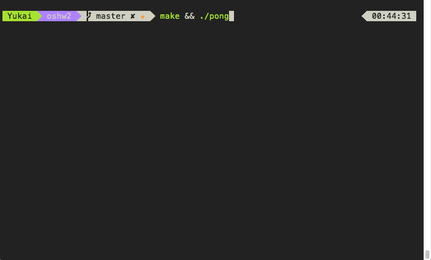
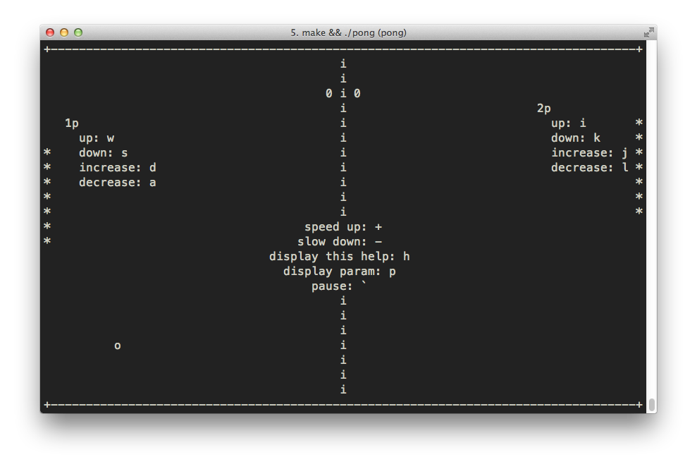
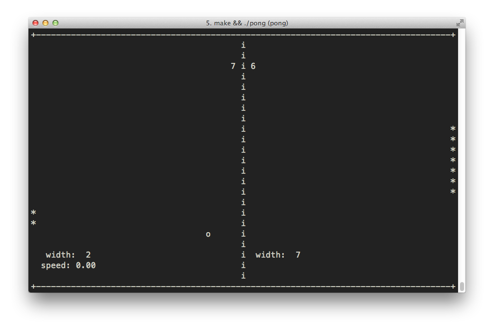
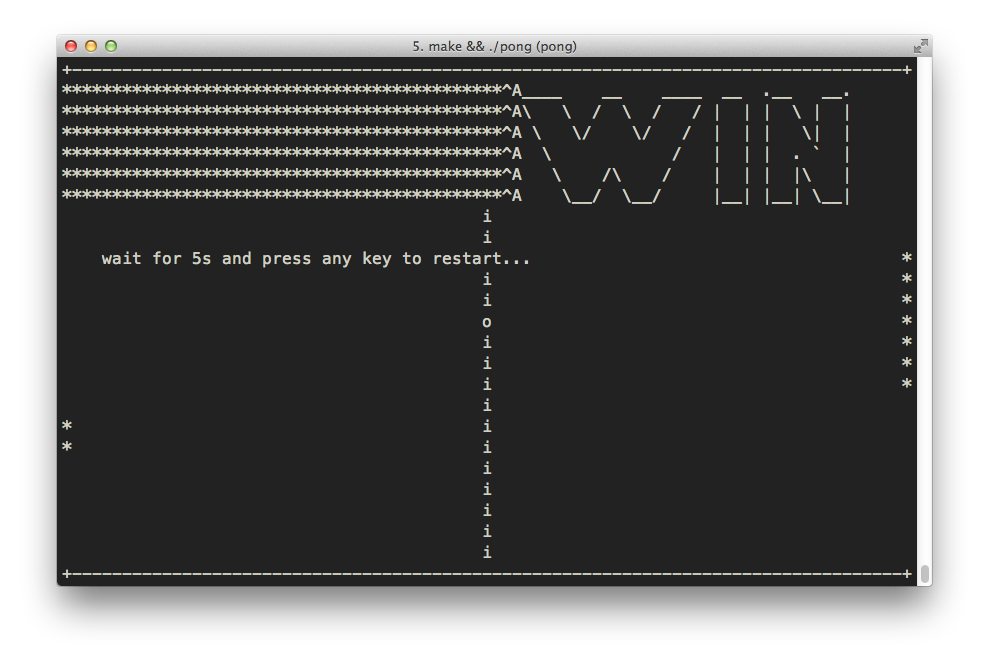

#作業系統作業二 - 執行緒之 Ping Pong
##概覽
###界面






##OSX 環境設定

```bash
	brew install ncurses
	brew ln ncurses --force
	make && ./pong
```

##基本操作
```
1p
	up: w
	down: s
	increase: d
	decrease: a
2p
	up: i
	down: k
	increase: j
	decrease: l

speed up: +
slow down: -
display help: h
display param: p
pause: `
```

##References
http://tldp.org/HOWTO/NCURSES-Programming-HOWTO/index.html